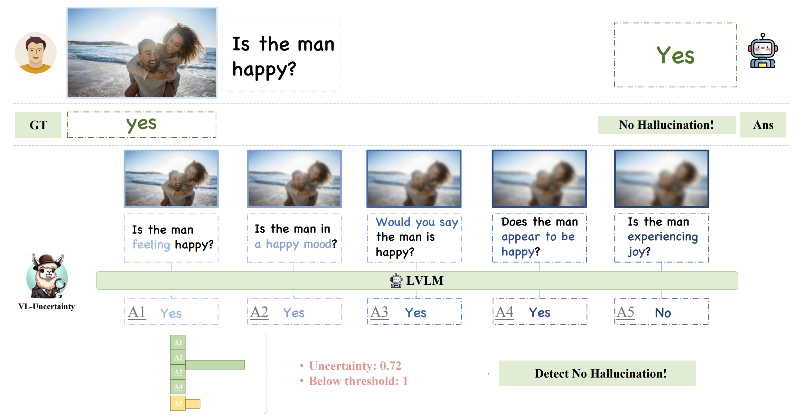
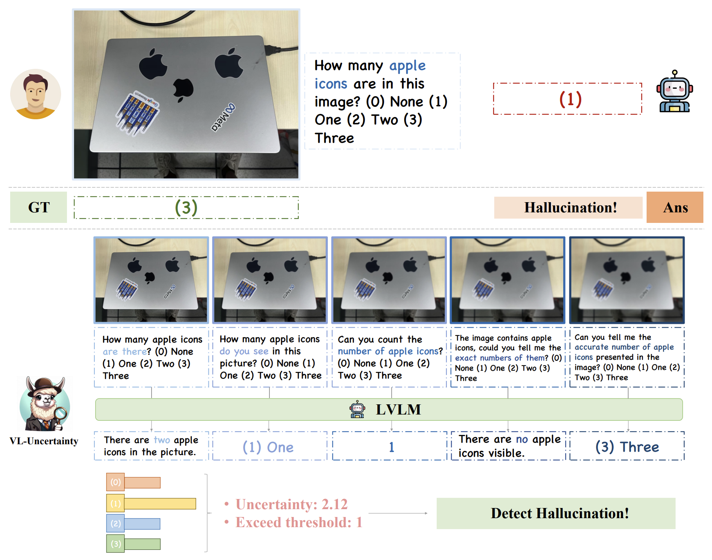

<h1 style="text-align: center;">
    
</h1>

# 🔎 VL-Uncertainty

[Ruiyang Zhang](https://ruiyang-061x.github.io/), [Hu Zhang](https://huzhangcs.github.io/), [Zehdong Zheng*](https://www.zdzheng.xyz/)

**[Website](https://vl-uncertainty.github.io/)** | **[Paper](https://arxiv.org/abs/2411.11919)** | **[Code](https://github.com/Ruiyang-061X/VL-Uncertainty)**

## 🔥 News

- 2024.12.19: 🐣 Source code of [VL-Uncertainty](https://arxiv.org/abs/2411.11919) is released!

## ⚡ Overview


## 🛠️ Install

- Create conda environment.

```
conda create -n VL-Uncertainty python=3.11;

conda activate VL-Uncertainty;
```

- Install denpendency.

```
pip install torch torchvision torchaudio --index-url https://download.pytorch.org/whl/cu121;

pip install transformers datasets flash-attn accelerate timm numpy sentencepiece protobuf qwen_vl_utils;
```

(Tested on NVIDIA H100 PCIe-80G, NVIDIA A100-PCIE-40GB, and A6000-48G)

## 🚀 Quick Start

- Run our demo code.

```
python demo.py;
```

- This should produce the results below. **VL-Uncertainty** can successfully estimate high uncertainty for wrong LVLM answer and thereby detect hallucination!

```
--------------------------------------------------
- Demo image: .asset/img/titanic.png
- Question: What is the name of this movie?
- GT answer: Titanic.
--------------------------------------------------
- LVLM answer: The movie in the image is "Coco."
- LVLM answer accuracy: Wrong
--------------------------------------------------
- Estimated uncertianty: 2.321928094887362
- Uncertianty threshold: 1.0
--------------------------------------------------
- Hallucination prediction: Is hallucination
- Hallucination detection: Success!
--------------------------------------------------
```

## 📈 Run

- For MM-Vet (Free-form benchmark)

```
bash run/run_MMVet.sh;
```

- For LLaVABench (Free-form benchmark)

```
bash run/run_LLaVABench.sh;
```

- For MMMU (Mutli-choice benchmark)

```
bash run/run_MMMU.sh;
```

- For ScienceQA (Mutli-choice benchmark)

```
bash run/run_ScienceQA.sh;
```

## 🏄 Examples

- VL-Uncertainty successfully detects LVLM hallucination:


- VL-Uncertainty can also assign low uncertainty for correct answer and identify it as non-hallucinatory:



- VL-Uncertainty effectively generalizes to physical-world scenario. (The following picture is my laptop captured by iPhone)



## ⌨️ Code Structure

- Code strucuture of this repostory is as follow:

```
├── VL-Uncertainty/ 
│   ├── .asset/
│   │   ├── img/
│   │   │   ├── logo.png
│   │   │   ├── titanic.png         # For demo
│   ├── benchmark/
│   │   ├── LLaVABench.py           # Free-form benchmark
│   │   ├── MMMU.py                 # Multi-choice benchmark
│   │   ├── MMVet.py                # Free-form benchmark
│   │   ├── ScienceQA.py            # Multi-choice benchmark
│   ├── llm/
│   │   ├── Qwen.py                 # LLM class
│   ├── lvlm/
│   │   ├── InternVL.py             # Support 26B, 8B, and 1B
│   │   ├── LLaVA.py                # Support 13B, 7B
│   │   ├── LLaVANeXT.py            # Support 13B, 7B
│   │   ├── Qwen2VL.py              # Support 72B, 7B, 2B
│   ├── run/
│   │   ├── run_LLaVABench.sh       # Benchmark VL-Uncertainty on LLaVABench
│   │   ├── run_MMMU.sh             # Benchmark VL-Uncertainty on MMMU
│   │   ├── run_MMVet.sh            # Benchmark VL-Uncertainty on MMVet
│   │   ├── run_ScienceQA.sh        # Benchmark VL-Uncertainty on ScienceQA
│   ├── util/
│   │   ├── misc.py                 # Helper function
│   │   ├── textual_perturbation.py # Various textural perturbation
│   │   ├── visual_perturbation.py  # Various visual perturbation
│   ├── .gitignore
│   ├── README.md
│   ├── VL-Uncertainty.py           # Include semantic-equvialent perturbation, uncertainty estimation, and hallucination detection
│   ├── demo.py                     # Quick start demo
```

## ✨ Acknowledgement

- [LLaVA](https://github.com/haotian-liu/LLaVA), [LLaVA-NeXT](https://github.com/LLaVA-VL/LLaVA-NeXT), [InternVL](https://github.com/OpenGVLab/InternVL), [Qwen2-VL](https://github.com/QwenLM/Qwen2-VL): Thanks a lot for those foundamental efforts!
- [semantic_uncertainty](https://github.com/jlko/semantic_uncertainty): We are inspired a lot by this work!


## 📎 Citation

If you find our work useful for your research and application, please cite using this BibTeX:

```bibtex
@article{zhang2024vl,
  title={VL-Uncertainty: Detecting Hallucination in Large Vision-Language Model via Uncertainty Estimation},
  author={Zhang, Ruiyang and Zhang, Hu and Zheng, Zhedong},
  journal={arXiv preprint arXiv:2411.11919},
  year={2024}
}
```